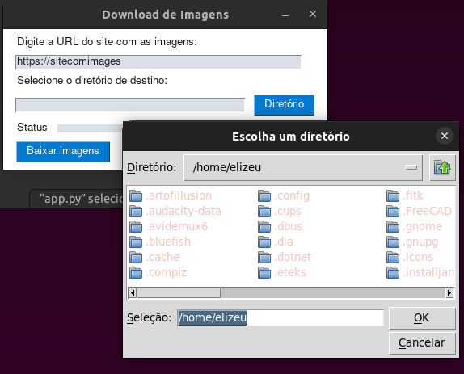

# Download de Imagens - Documentação do Projeto

Este projeto é um aplicativo Python que permite baixar imagens de um site e salvá-las em um diretório local. O aplicativo possui uma interface gráfica criada com o PySimpleGUI para facilitar a interação do usuário.



## Requisitos
- Python 3.6 ou superior
- Pacotes Python listados no arquivo requirements.txt
## Configuração do Ambiente
- Clone o repositório do projeto:

~~~
git clone https://github.com/elizeubarbosaabreu/Baixador-de-Imagens.git
cd Baixador-de-Imagens
~~~
-Crie e ative um ambiente virtual (opcional, mas recomendado):
~~~
python -m venv venv
source venv/bin/activate
~~~

Obs: Se estiver usando Windows o comando para ativar a máquina virtual é ```venv\Scripts\activate```
- Instale as dependências do projeto:

~~~
pip install -r requirements.txt
~~~

### Executando o Aplicativo
Para executar o aplicativo, utilize o seguinte comando:

~~~
python main.py
~~~
Isso abrirá a interface gráfica do aplicativo.

### Instruções de Uso
- Na interface gráfica, digite a URL do site que contém as imagens no campo "Digite a URL do site com as imagens".

- Clique no botão "Salvar" ao lado do campo "Selecione o diretório de destino" para escolher o diretório onde as imagens serão salvas.

- Clique no botão "Baixar imagens" para iniciar o processo de download das imagens. Uma barra de progresso será exibida para acompanhar o andamento do download.

### Exemplo de Uso
- Digite a URL do site com as imagens: https://www.example.com/images/
- Selecione o diretório de destino: caminho/para/diretorio/destino
- Clique no botão "Baixar imagens".
- As imagens do site https://www.example.com/images/ serão baixadas e salvas no diretório caminho/para/diretorio/destino.

### Atenção
Este aplicativo faz download de imagens da web. Certifique-se de ter permissão para baixar as imagens do site em questão, respeitando os termos de uso do site.

### Contribuindo
Se você deseja contribuir para o projeto, fique à vontade para criar um pull request com suas alterações ou abrir uma issue para relatar problemas ou sugestões.

### Licença
Este projeto está licenciado sob a **licença MIT**.

